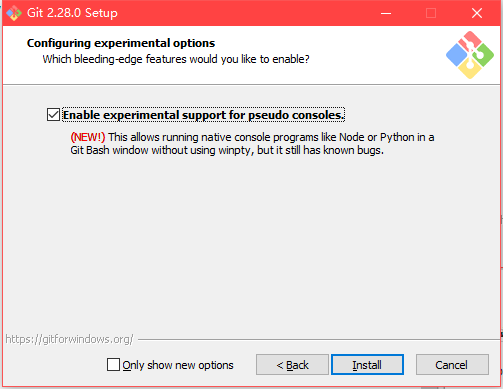
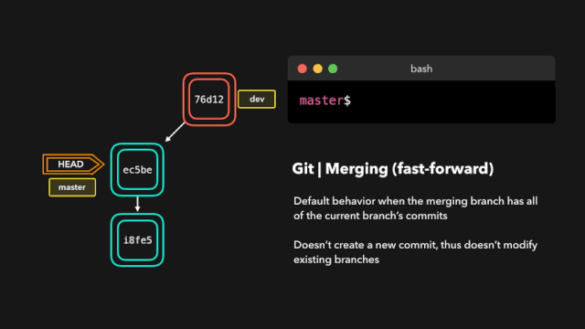
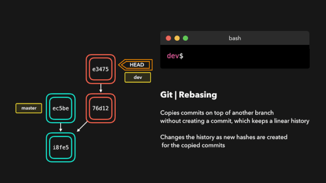
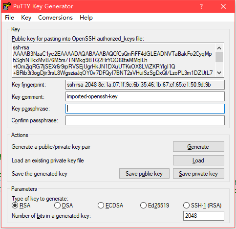
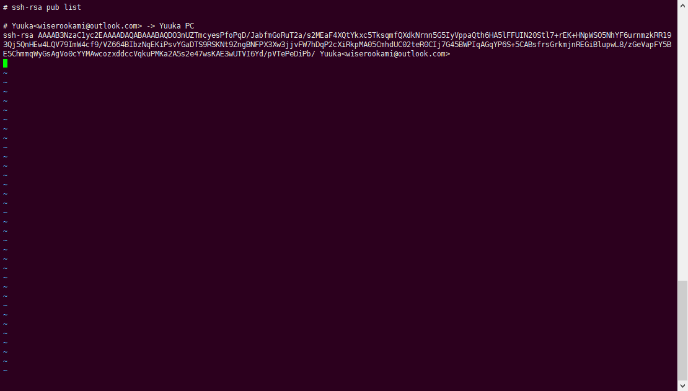

# Git完整使用教程 #

----------

本教程主要介绍`Git`的安装与使用与常用操作，`Git`与`SVN`的区别及优势，同时对比介绍两款`Git第三方GUI工具`。

----------

- ### Git基本介绍 ###

	`Git`，分布式版本控制系统。`Linus Torvalds`为了管理`Linux内核`开发而开发的一款开源的版本控制软件。注意，原生`Git`对大文件的支持不好，当然也有解决的方法。通常我们使用`Git`管理我们的代码，由于`Git`的优秀的代码分支系统和只针对本地仓库进行提交的特性，我们可以很方便的不用过分理会他人的对本地代码的一个里程碑进行提交，而达到充分发挥代码版本管理的优势。同时由于`Git`具有分布式的特性，对容灾有很大的宽容度，当灾难发生，我们可以将本地的`Git仓库`以镜像方式提交到新建立的`Git仓库`上，这时这个仓库就具有本地`Git仓库`所拥有的所有分支的所有历史提交记录。

- ### Git与SVN对比 ###

|\|`Git`|`SVN`|
|-|-|-|
|管理模式|分布式|中心式|
|具有中心|相对（可以）具有中心|必须具有中心|
|本地提交|可以本地提交|必须每次提交到中心|
|权限控制|没有原生的方便的权限管理|具有原生的灵活的权限控制|
|仓库和工作区|即可单独创建仓库也可以创建一个带有工作区的仓库|两者必须分离|
|版本号|通过文件及目录结构计算`SHA-1`，全球唯一|全局唯一|
|部分检出|只能全部检出|可以部分检出|
|提交|分为提交到本地仓库和推送到远程仓库|只有提交到远程仓库的选项|
|分支|是完全隔离的，分支文件是对应版本的校验和文件加换行符，不是真正的文件|并非完全隔离，但分支也相当于一个索引|
|提交|可以撤销最后一次提交|不能撤销提交|
|传输协议|`ssh`或`http`|`svn`或`http`或`ssh`|

- ### Git对于版本管理的优势及缺点 ###

	- 优点
		- 强调个体，更适合多人协助开发场景。
		- 无需时刻关注中心，可以离线工作。
		- 更加灵活，同时速度更快。
	- 缺点
		- 更复杂，学习难度更高。
		- 保密性差，没有方便的权限管理功能。

- ### Linux安装Git并配置Git ###

	安装
	
		以CentOS7.3为例，执行命令
		yum install git -y
		即可安装git。（需要网络）

	验证

		执行命令
		git --version
		显示版本号
		git version 1.8.3.1
		即表示git安装完成。

	配置

		添加一个用户，或使用一个现有的用户，例如用户名为git2020
		useradd git2020
		在用户家目录添加公钥验证许可列表文件
		cd /home/git2020
		mkdir .ssh
		cd .ssh
		touch authorized_keys
		修改目录及文件权限
		chmod 755 /home/git2020/.ssh
		chmod 644 /home/git2020/.ssh/authorized_keys
		若使用的是非root用户，但却用root来执行上面的命令，那么还需要修改文件及文件夹的所有者。
		chown -R git2020:git2020 /home/git2020/.ssh

	限制

		若想限制git2020这个用户，让这个用户只能用于git的访问，可以执行一下操作。(仅限用root权限的情况下)
		vi /etc/passwd
		找到git2020用户的那一行，让后将最后面的/bin/bash修改成/usr/bin/git-shell，这样git2020这个用户就限制成了只能用于git操作了。

	这样我们Git服务器的配置就基本完成了，之后我们要收集各个用户的公钥，将他们的公钥加入到authorized_keys中，一行一个，这个操作会在之后的`整体配置流程`章节中的例子进行说明。

- ### Windows安装Git并配置Git ###

	登录`git官方网站`[https://git-scm.com/](https://git-scm.com/)，下载`最新版Git`，对应系统下载对应版本。
	目前`windows Git`的最新版本是`2.28.0`
	
	下载完成双击安装，注意若你不是第一次安装，在安装页面的下方会有一个`Only show new options`的选项默认选中，这表示非新增选项将延用之前的设置，这里我将这个选项去掉，以保证和第一次安装的显示一样。点击`Next >`进行下一步操作。
	
	勾选以下功能，`Additional icons` -> 在桌面填加图标，`Windows Explorer integration` --> 为资源管理器右键添加`Git Bash Here`与`Git GUI Here`的快捷方式，`Git LFS` --> 添加`Git大文件的支持`，`Associate .git*` --> `Git软件`对`.git*类型文件`进行关联，默认用`Git软件`打开，`Associate .sh` --> `Git软件`对`.sh类型文件`进行关联，默认用`Git`进行运行。
	
	选择`Git默认编辑器`，通常我们需要配合其他的编辑器或相关软件来使用`Git`，所以这步选一个合适的即可，也可以不选，使用默认的。
	
	为`Git`添加到环境变量中，选择第二个，可以让我们在`windows命令行`中也可以使用`Git命令`，但由于之后我们要使用`GUI工具`来操作`Git`，所以这步不需要做过分关系。注意，第三个选项会影响原有的`windows命令`。
	
	使用`OpenSSL库`做安全验证，或使用`本地Windows安全通道库`。选第一个使用`OpneSSL库`就好，这部分我们目前用不到。
	
	文件行尾风格选择，选第一个，检出时将行尾设置为`windows`的`\r\n`风格，提交时转换成`Unix`的`\n`风格。
	
	选择`Git Bash`的终端模拟器，第一个，使用`MiniTTY`，第二个使用`windows默认控制台`窗口 -- `cmd.exe`，由于`cmd.exe`的显示上的弱势，一般我们选择第一个，当然，如果我们使用第三方工具，那么`Git Bash`的使用率会大幅度降低，所以这个选择也不会造成什么影响。
	
	选择`git pull`的默认行为，第一个默认就好，快速覆盖或合并，仅仅选择的是默认的`git pull`行为，对我们真正操作的情况影响很小。
	
	选择证书管理帮助，主要是为了方便连接`Azure DevOps`或`GitHub`一些代码托管平台的，选择第二个就好。
	
	第一个，弃用文件缓存，将内容批量的写内存，提升性能明显，正常情况硬件条件基本允许，需要勾选。启用符号链接(软链接)，没用过，正常情况应该不需要，请了解后再适时勾选。
	
	实验性功能，允许在不安装`winpty`的情况下在`Git Bash`里执行类似`Node`或`Python`的命令。可以点上，也可以不点。
	点击`Install`进行安装。
	
	安装完成，不用勾选内容，直接点击`Next >`完成安装即可。
	
	随意找到一个文件夹，然后右键空白处，右键菜单出现`Git GUI Here`，`Git Bash Here`，即可以表示安装正确。
	
	
- ### 密钥对，非对称加密  ###

	若想要各个`Git`进行通信或想要提交的代码到`Git中心仓库`上，那么我们就需要用`ssh密钥对`。由于`Git`可以通过`ssh通信`，那么只要使用密钥对，让两台设备可以通过密钥对进行通信，就完成了`Git服务器`的基本配置。
	`非对称ssh密钥对`，分为公钥和私钥，一般我们通过`ssh-keygen`创建密钥对。公钥加密的内容可以被私钥解析，私钥加密的内容可以被公钥解析。
	创建一对密钥，执行命令`ssh-keygen -t rsa -C "comment"` --> `ssh-keygen -t`表示类型，我们使用`rsa类型`，`-C`表示注释内容，注释内容需要添加双引号，这个注释之后添加到公钥文件中。注意，密钥长度默认`2048`，使用`-b 4096`可以生成`4096长度的key`，破解难度变大，更安全，某些情况可能需要使用。
	
	创建时可以选择位置和添加密码。
	
	`id_rsa`为私钥，`id_rsa.pub`为公钥
	注意，每次生成的公钥和私钥内容都不同
	将公钥内容添加到`authorized_keys`文件中，依然以之前创建的用户`git2020`为例，执行命令
		cat id_rsa.pub >> /home/git2020/.ssh/authorized_keys
	就可以将公钥追加到`authorized_keys`中了。
	私钥我们要保存下来，之后用于本地配置`Git`，来访问添加了公钥的设备的`Git仓库`。
	注意，理论上私钥公钥地位对等，无法互相导出，但是`rsa`生成的私钥内容包含了公钥的内容，所以造成了私钥可以推导出公钥的现象。（注意，这句不是在任何情况下都正确）

- ### Git基础概念补充 ###

	本地仓库:`remote`
		本地设备存储的代码仓库，包含所有代码分支及历史。

	远程仓库:`repository`
		远程设备存储的代码仓库，一般是中心设备，同样包含所有的代码分支及历史。注意一般中心仓库没工作区。

	分支:`branch`
		代码版本分支，代码仓库中代码的一个分支，分支的选择会直接影响工作区存储的代码。

	提交:`commit`
		提交发生在暂存区与本地仓库之间。
		
	推送:`push`
		推送发生在本地仓库和远程仓库之间。

	拉取:`pull`
		将远程仓库的内容下载到本地，并合并到当前上。

	工作区:`working directory`
		本地代码真实文件存储的位置。

	暂存区:`index`
		将要添加的到本地仓库的文件修改先暂时存放的位置。介于工作区与本地仓库，目的就是区分工作区内要提交和不要提交的内容，要提交内容就add加到暂存区。

	

- ### Git常用命令 ###

	- #### 配置Git使用的用户名和email ####
			git config --global user.name "<NAME>" --> git config --global user.name "USER1"
			git config --global user.email "<MAILNAME@MAIL.COM>" --> git config --global user.email "gituser1@email.com"

	- #### 初始化一个仓库 ####
			git init <PATH> --> git init /home/git2020/my_python_code  # 仓库附带工作区
			git init --bare <PATH> --> git init --bare /home/git2020/my_python_code.git  # 裸仓库，注意my_python_code.git是文件夹名

	- #### 克隆一个远程仓库到本地 ####
			git clone gitname@ip:PATH -> git clone git2020@192.168.100.100:/home/git2020/my_python_code.git
			这样就会下载一个带有工作区的仓库到本地执行命令的位置。
	
	- #### 提交文件或文件夹到暂存区 ####
			git add <FILE.[*] or PATH> --> git add readme.txt / git add .

	- #### 提交暂存区内容到本地仓库， 不加-m会进入编辑器模式。 ####
			git commit -m "MESSAGE" -> git commit -m "upload readme.txt"

	- #### 显示文件，文件夹在工作区，暂存区的状态 ####
			git status
			git status -s 以简洁（简短）模式显示，-s == --short

	- #### 查看尚未添加到暂存区的改动，添加不同的参数可以达到对比不同区域的效果 ####
			git diff
			git diff -HEAD  # 比较工作区与最新本地版本库

	- #### 删除对文件的版本控制，并删除工作区对应文件 ####
			git rm <FILE> --> git rm readme.txt
			git rm --cached <FILE> --> git rm --cache readme.txt  # 仅取消文件的版本控制，但不真正删除工作区的对应文件

	- #### 在版本库的概念上移动文件的位置 ####
			git mv <OLD FILE> <NEW FILE> --> git mv readme.txt readme_new.txt

	- #### 列出本地所有分支，或通过这个命令操作分支 ####
			git branch
			git branch  # 显示分支同时显示对应远程仓库的分支名
			git branch <BRANCH NAME> --> git branch new_branch  # 依照当前分支的最后一次commit来创建一个名为new_branch的分支
			git branch -d <BRANCH NAME> --> git branch -d new_branch  # 删除分支

	- #### 切换分支 ####
			git checkout <BRANCH NAME> --> git checkout new_branch

	- #### 合并分支到当前分支上 ####
			git merge <branch name> --> git merge dev
	
	- #### 查看历史提交记录 ####
			git log
			git log --oneline  # 以简洁模式显示
			git log --graph  # 以拓扑图的模式显示
	
	- #### 以列表形式查看指定文件的历史修改记录 ####
			git blame <FILE> --> git blame readme.txt

	- #### Fast-forward(git merge dev --ff) ####
	
	
	- #### No-fast-foward(git merge dev --no-ff) ####
	

	- #### 合并冲突 ####
	

	- #### 分支基础变更，变基 git rebase <brance> --> git rebase master ####
	

			重置库的头指针位置，git reset，重置头指针到上一个，其实就是撤销commit。注意这个命令的默认参数是`--mixed`。这个命令的真实目的是移动HEAD指针。
	
	- #### 软重置，git reset --soft HEAD~2，重置两次提交，移动头指针，但不真的删除内容，将撤销的内容放在暂存区，工作区内容也不会发生改变。 ####
	
	- #### 硬重置，git reset --hard HEAD~2，重置两次提交，移动头指针，删除提交过的内容，清空暂存区，工作区也恢复到之前的内容。 ####
	
	- #### 混合，git reset HEAD~2，重置两次提交，移动头指针，删除提交过的commit，清空暂存区，但工作区内容保留。 ####

	- #### 反向提交，通过git log --oneline可以查看各个提交id，注意这样操作很可能会产生冲突，若产生冲突，那么需要收到解决冲突，再进行提交。 ####
			git revert <commit id> --> git revert ec5be
	

	- #### 提交复制，通过git log --oneline可以查看各个提交id，注意这样操作很可能会产生冲突，若产生冲突，那么需要收到解决冲突，再进行提交。 ####
			git cherry-pick <commit id> --> git cherry-pick 76d12
	

	- #### 远程仓库内容取回到本地，但不会进行主动合并 ####
			git fetch <REMOTE HOSTNAME> [BRANCH NAME] --> git fetch origin master
	
	
	- #### 远程仓库内容取回到本地，并主动合并分支，相当于git fetch + git merge，注意出现冲突依然要自己合并冲突并提交 ####
			git pull <REMOTE HOSTNAME> [REOMTE BRANCH NAME][:LOCAL BREACH NAME] --> git pull origin master:master  # 注意不指定本地分支名就和远程分支名一致
	

	- #### 显示所有操作的日志 ####
			git reflog
	
			然后，你可以根据这些去操作自己的仓库
	

	- #### 推送本地仓库修改到远程仓库 ####
			git push <REMOTE HOSTNAME> [LOCAL BRANCH NAME][:REOMTE BREACH NAME] --> git push origin master:master
			git push --force origin master  # 忽略差异，强制推送
			git push origin --delete master  # 删除远程仓库master分支

- ### Git常用操作 ###

	多密钥
		无论是Git软件，还是sourcetree或TortoiseGit都支持多密钥，也就是加载多个私钥，这样我们可以准备多个密钥来实现一些特殊的功能。

	仓库迁移
		git push --mirror <GIT URL> --> git push --mirror git2020@192.168.1.10:/home/git2020/tmp.git  # 通过这样的一个命令，我们可以将本地仓库所有内容，包括历史，迁移到一个远程的仓库上。

	github
		为github添加公钥，这样本地内容就可以push到github上了。

	支持http的git服务器
		我们也可以搭建一个支持http的git服务器，这样可以有更多的人看到git仓库的并拉起仓库，但无法推送内容到远程仓库。

- ### TortoiseGit 小乌龟工具安装介绍（`windows`） ###
	
	`TortoiseGit`，`SVN第三方界面`的老朋友了，`SVN版`的叫`TortoiseSVN`，依然有中文支持，同时与`TortoiseSVN`的操作类似，上手很方便。

	下载`TortoiseGit`。
	[https://tortoisegit.org/download/](https://tortoisegit.org/download/)页面选择对应版本下载，注意下面的中文简体语言包也要下载，先安装主程序，然后再安装语言包。
	安装过程十分简单，没有特别要关心的，基本一路next就好。
	`Next >`
	
	`Next >`
	
	`Next >`
	
	`Next >`，注意若要修改安装路径，在这步
	
	`Install`
	
	`Finish`，注意勾选第二个选项，立刻进行一些基础配置。
	
	我们先不理会弹出的页面，开始安装下载好的语言包，双击，然后下一步，然后完成即可安装语言包。
	回到刚才弹出的页面，点击`Refresh`，然后选择`中文`，然后`下一步`。
	
	`下一步`
	
	选择`Git软件`的路径，选择之前安装的`Git`就好，`下一步`
	
	配置`Git`的用户名和邮箱，`下一步`
	
	点击完成就好，注意`windows`的私钥也放在`~./ssh`下，详细参见`整体配置流程`
	
	自此，`TortoiseGit`安装完成，文件夹空白处右键可以看到TortoiseGit相关内容。我们可以点击设置，重新配置上面设置的内容，甚至重新修改语言。
	
	基于对`Git`的理解，我们可以轻松的使用这个工具来进行克隆、提交、推送的操作，涉及内容较多，这里不做过多描述。
	注意，在克隆库或在设置的`Git`选项中填写私钥的位置选择私钥文件以保证可以正常克隆或推送。同时`TortoiseGit`使用的是`ppk格式`的密钥，这是一种既包含私钥也包含公钥的格式，我们手上生成的密钥是`OpenSSH格式`的，需要装换成`ppk格式`，使用`TortoiseGit`安装目录`bin`下的`puttygen.exe`工具（例如我的这个工具就在`C:\YuukaProgram\TortoiseGit\bin\puttygen.exe`），我们可以转换我们的密钥格式。
	打开`puttygen.exe`工具
	
	选择`Conversions` --> `Import key`导入我们的私钥文件
	
	私钥导入完成后的显示
	
	点击`Save private key`（存储私钥），然后点`是`，注意保存成`.ppk格式`。
	
	点击`加载Putty密钥`，然后选择我们刚刚生成的文件，即可正常的克隆远程仓库
	
	当然也可以添加到`TortoiseGit`的配置中，`Git`选项，注意点选`全局`，点掉`继承`，然后将`.ppk格式的key`的文件位置写到这。
	
	这样之后我们就不用每次都选择`加载Putty密钥`这个选项了，这个选项就可以屏蔽掉了。
	当然，在最初安装的时候（如下图），如果选择的是`OpenSSH`，而不是`TortoiseGitPlink`时，我们将不需要以上的步骤，可以直接使用生成的私钥文件。
	

- ### SourceTree 工具安装介绍（`windows`） ###

	`SourceTree`，老牌的`Git GUI管理工具`了，也号称是最好用的`Git GUI工具`，也是个人最推荐的一款管理工具。同样上手方便，而且功能丰富。
	下载`SourceTree`
	[https://www.sourcetreeapp.com/](https://www.sourcetreeapp.com/)页面选择下载对应的版本，软件自带中文，直接下载安装即可。
	安装过程十分简单，没有特别要关心的，基本一路next就好。
	直接`跳过`，现在新版本不会强制注册账号了，如果你的版本需要登陆其中一个的账号，请下载最新版本。
	
	如果有网络的话，可以选择`Mercurial`，`Mercurial`是一个与`Git`近似的工具，但比`Git`要更加简洁（简单（用不上的功能更少）），`sourcetree`会自动找到`Git软件`。
	
	若选择了`Mercurial`，等待下载完成。
	
	下载完成，`下一步`
	
	配置`Git用户名`和`邮箱`
	
	可以选`是`，加载自己的私钥文件，也可以选择`否`，一会选择。
	
	安装完成的页面。
	
	进入`工具` -> `选项`，在这里可以选择私钥文件，注意，没有私钥文件，克隆库将会受到阻碍。
	
	尝试`Clone`一个仓库，显示`这是一个Git仓库`，表示已经可以正常通信到`Git远程仓库`。
	
	基于对`Git`的理解，我们可以轻松的使用这个工具来进行克隆、提交、推送的操作，涉及内容较多，这里不做过多描述。

- ### 整体配置流程 ###
	
	1.下载`Git`，下载`sourcetree`（这里以sourcetree为例），`Linux`上安装`Git`，并创建`Git用户`和`authorized_keys`文件。（以上都有描述，这里不再总结）
	2.在`windows端`生成`密钥对`。这里我们用`windows`的`PowerShell`，`windows`内容搜索就可以找到。当然也可以在`Linux`内执行一样的命令生成再下载到`个人PC`上。
	3.通过命令`ssh-keygen -t rsa -C "Yuuka<wiserookami@outlook.com>"`和`三次回车`，我们在用户路径（`C:\Users\用户`）下生成了一对密钥`id_rsa`与`id_rsa.pub`。
	4.`cd`到`.ssh`下，然后`cat id_rsa.pub`，查看公钥内容。
	
	5.`Linux`端`vi authorized_keys`直接编辑文件，注意公钥是比较长，看上去像分行了，但实际上是一行，可以的话添加注释，以防止忘记。
	
	6.可以通过`ssh-copy-id`命令将公钥添加到远程服务器上，`-i`参数为对应的公钥文件位置，后面的是服务器的`用户名@ip`，执行这条命令会自动的在对应目录创建`authorized_keys`文件并添加公钥信息，第一次执行需要输入密码（也就是说，如果这个远程用户名没有密码，就无法创建），注意`windows`下没有`ssh-copy-id`这个命令，需要使用`Git Bash`界面来执行这个命令，同时`Git Bash`的`C盘`目录为`/c/`，`Git Bash`内支持`cd`等常用`Linux`风格命令。
	
	7.`Linux`端`git init --bare TmpProject_20200830_ForTestGit.git`创建一个空的库，然后用`sourcetree`克隆这个远程仓库。（注意`git路径`为`绝对路径`）
	
	8.克隆这个空的仓库，然后在这个仓库的工作区文件夹中添加一个文件，这里我添加的是`readme.txt`并随意的写了些内容。
	9.这里我们发现`sourcetree`已经发现了这个文件，我们点击这个文件后面的加号，将它加入`暂存区`。
	
	10.文件已经被加入到了`暂存区`。
	
	11.填写提交日志，然后`提交`。
	
	12.这时我们发现已经有一个提交的日志在本地了。
	
	13.推送内容到远程仓库，点击`推送`，然后`推送`
	
	14.我们发现`远程仓库`与`本地仓库`的历史是一样的，证明推送已经成功了。
	
	15.这就是从服务器到客户端的一个整体配置及测试的流程。

- ### Git应用要求 ###

		配置真实的信息，不要恶意推送，本地可以根据代码的功能更新多次提交，然后再一口气推送到中心仓库。
		必要的时候，拉一个新分支去更新自己的内容，然后再将分支合并到主分支上，这样可以更显而易见的看到更新的内容。
		不要随意的在Linux终端操作中心仓库真实文件，也不要随意的上传大文件。
		多次更新，每次的日志应尽量简短，描述问题应简洁准确。
		慎用硬重置，如果需要，尽量使用默认的混合重置。
